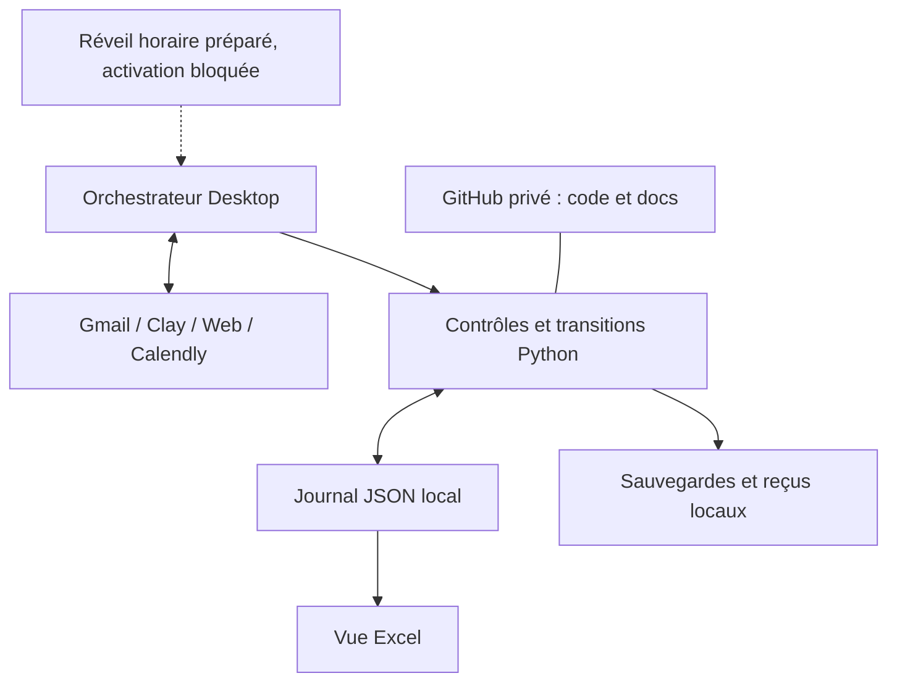

# GTM Vision PnL local

Installation locale pour un seul orchestrateur Desktop utilisant les plugins Gmail,
Clay, Web et Calendly. Le code assure journal, contrôles, sauvegardes et reprise.
Il ne contient ni client de modèle ni client Gmail autonome. Les réponses automatiques
ne sont pas actives tant que les gates ne sont pas prouvées.

## Ouvrir et reprendre

Dans Desktop, ajouter un projet local en choisissant **ce dossier gtm-vision-pnl**,
puis ouvrir une tâche locale dans ce projet. Choisir **GPT-6 Astra** dans le sélecteur.
Le miroir parent ChatGPT et `sources/` restent des références non modifiées. Ne pas
travailler dans un nouveau worktree sans les données locales : elles sont hors Git.

Demande de reprise : « Lis AGENTS.md, vérifie le statut local et reprends la migration
sans nouvel envoi de campagne. » Le modèle n'est jamais sélectionné par un fichier.

## Commandes

Depuis ce dossier, Python 3.12–3.14, aucune dépendance Python externe :

```powershell
python -X utf8 scripts/gtm.py status
python -X utf8 -m unittest discover -s tests -v
python -X utf8 scripts/gtm.py stop
python -X utf8 scripts/gtm.py recover
python -X utf8 scripts/gtm.py monitor
```

`stop` est l'arrêt d'urgence. Mettre aussi la tâche Scheduled en pause pour arrêter
les réveils. `monitor` reprend la lecture contrôlée ; il ne lance pas de processus.
`live` n'est accepté que lorsque tous les prérequis sont prouvés. La première activation
et les interfaces de fichiers sont décrites dans [le runbook](docs/RUNBOOK.md).

## Fichiers

| Chemin | Rôle | Git |
|---|---|---|
| local/GTM_Design_Partners_Etat.json | Unique référence, historique et état technique local | Non |
| local/Design_partners_FR_CH_BE.xlsx | Vue Excel réconciliée | Non |
| local/WORKFLOW_SOURCE.md | Workflow original complet et messages validés | Non |
| local/originals/ | Copies exactes des trois pièces d'entrée | Non |
| local/evidence/ | Vérifications, audit et traces réelles | Non |
| local/backups/, local/receipts/ | États récupérables et preuves d'envoi | Non |
| scripts/, tests/ | Moteur local et simulations | Oui |
| docs/, examples/ | Procédures génériques et configuration synthétique | Oui |

Après un clone, réimporter les trois fichiers privés avec `scripts/gtm.py init
--journal CHEMIN --workbook CHEMIN --workflow CHEMIN`. Init refuse d'écraser un état
existant. Les secrets ne doivent jamais être collés dans une conversation ni committés.
Authentifier les plugins dans l'interface du compte ; leur OAuth n'est pas disponible
automatiquement dans Python ou GitHub Actions.

L'outil facultatif `scripts/refresh_workbook.mjs` utilise le runtime Desktop fourni
(@oai/artifact-tool 2.8.59, bundle 26.905.11957), sans téléchargement. Le cœur Python
fonctionne sans lui. Il actualise les notes de migration de la vue, pas une synchronisation
bidirectionnelle. Toute modification métier doit d'abord être enregistrée dans le JSON.
Les annotations de migration sont datées du contrôle initial ; les revalider avant
de régénérer la vue après activation.

## Architecture installée



Le PC, l'application et Internet sont nécessaires pour ce fonctionnement local.
L'ancienne tâche n'est pas modifiée pendant l'installation. Voir [planification et
coûts](docs/SCHEDULING.md) et [workflow métier](docs/WORKFLOW.md). Aucun workflow GitHub
Actions n'est installé : il ne fournit pas le déclenchement local Astra nécessaire.

## Vérifications

Tests en simulation : doublon, refus, réponse humaine entre préparation/envoi,
envoi incertain, panne de sauvegarde après envoi, redémarrage, réception dupliquée,
concurrence, plafond de réponses, arrêt d'urgence, pagination et réservation vérifiée.
Ces tests ne constituent pas une preuve d'envoi réel ni de déclenchement planifié.
Les preuves propres à cette installation sont dans local/evidence/DELIVERY.md.
