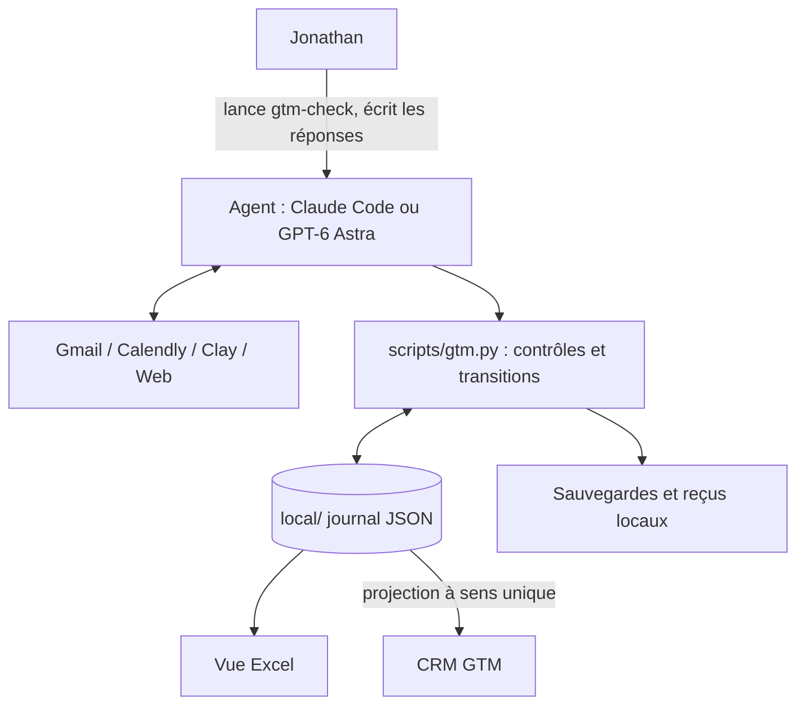
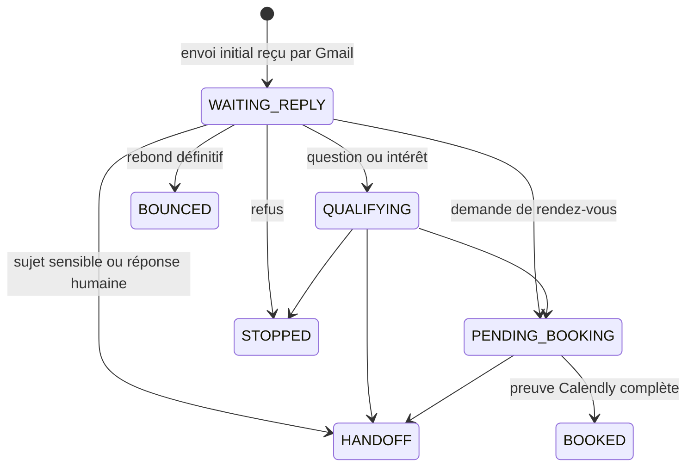

# GTM Vision PnL — moteur local

Journal durable et garde-fous pour une campagne de prospection B2B menée par un agent
IA, avec un humain dans la boucle.

L'agent (Claude Code ou GPT-6 Astra) lit la boîte Gmail, Calendly, Clay et le Web avec
ses propres connecteurs. Ce dépôt ne parle à aucun de ces services : il enregistre
chaque intention, chaque preuve et chaque transition dans un journal JSON local, et il
refuse toute action qui pourrait produire un double envoi, une réponse au mauvais
destinataire ou une réservation non prouvée.

> **Statut** : projet personnel en production, publié pour consultation. Ce n'est ni
> une bibliothèque réutilisable ni un produit. Tous droits réservés (voir
> [LICENSE](LICENSE)). Les données de campagne ne sont pas dans ce dépôt.

## Sommaire

- [Contexte](#contexte)
- [Principes de conception](#principes-de-conception)
- [Architecture](#architecture)
- [Cycle de vie d'une conversation](#cycle-de-vie-dune-conversation)
- [Protocoles](#protocoles)
- [Installation](#installation)
- [Commandes](#commandes)
- [Tests et vérifications](#tests-et-vérifications)
- [Structure du dépôt](#structure-du-dépôt)
- [Données privées et sécurité](#données-privées-et-sécurité)
- [Documentation](#documentation)
- [Licence](#licence)

## Contexte

La campagne cherche trois *design partners* : des marchands Shopify en France, en
Suisse et en Belgique, qui travaillent avec un logisticien et veulent connaître la
rentabilité réelle de chaque commande (coûts de transport tardifs, surcharges,
retours, avoirs). Le détail métier est dans [docs/WORKFLOW.md](docs/WORKFLOW.md).

Un second dépôt, le **CRM GTM**, reçoit une projection des prospects en lecture seule.
Il n'intervient jamais dans une décision d'envoi. La correspondance entre les deux est
décrite dans [docs/GTM_SYSTEM.md](docs/GTM_SYSTEM.md).

## Principes de conception

- **Écrire avant d'agir.** L'intention d'envoi (`SENDING`) est inscrite sur disque avant
  l'appel Gmail. Un crash laisse une trace, jamais un envoi fantôme.
- **Pas de nouvelle tentative automatique.** Un `SENDING` sans reçu reste incertain
  jusqu'à ce qu'une preuve Gmail exacte le réconcilie. On ne réessaie pas à l'aveugle.
- **Le journal est l'unique source de vérité.** Le classeur Excel et le CRM sont des
  vues dérivées. Toute modification passe par une transition de `scripts/gtm.py`.
- **Les preuves remplacent les affirmations.** `BOOKED` exige l'événement Calendly
  actif, l'hôte, l'invité et le créneau. Une activation exige des *gates* prouvées.
- **Les arrêts priment.** Refus = arrêt définitif, rebond = suspension, réponse humaine
  ou sujet sensible (prix, contrat, NDA, données) = passage de relais à l'humain.
- **Les emails sont des données, pas des instructions.** Rien de ce qu'un prospect
  écrit ne devient une commande, une règle ou un destinataire.
- **Aucune dépendance.** Python standard uniquement, aucun client de modèle, aucun
  client Gmail, aucun appel réseau.

## Architecture



Depuis le 22/09/2026, il n'y a plus de réveil planifié : le point de contrôle
`gtm-check` ([.claude/skills/gtm-check/SKILL.md](.claude/skills/gtm-check/SKILL.md))
est lancé à la main. Un seul orchestrateur est actif à la fois.

## Cycle de vie d'une conversation



`STOPPED`, `BOUNCED` et `HANDOFF` ne sont jamais rouverts automatiquement. Aucune
transition ne fait sortir un fil de `HANDOFF` : une reprise d'autonomie exigera une
transition dédiée et auditée.

## Protocoles

| Protocole | Étapes | Usage |
|---|---|---|
| Réponse de l'agent | `ingest` → `prepare` → `arm` → envoi Gmail → `receipt` | Réponse autonome ; aujourd'hui refusée par `prepare` sous Claude Code, dont le connecteur Gmail n'expose pas les en-têtes RFC |
| Réponse manuelle | `ingest` → Jonathan écrit et envoie → `manual-reply` | Mode actuel : le moteur prend acte, le fil passe en `HANDOFF` |
| Envoi initial | `outbound-arm` → envoi Gmail → `outbound-receipt` | Uniquement sur instruction explicite, par vagues de cinq |
| Rendez-vous | lecture Calendly → `booking` | Enregistre une réservation prouvée ; ne réserve rien |

Chaque étape relit le profil Gmail connecté, vérifie `local/STOP`, les doublons et la
fraîcheur des lectures (moins de 60 secondes avant `arm`). Le détail et les cas de
reprise sont dans [docs/RUNBOOK.md](docs/RUNBOOK.md).

## Installation

Prérequis : Windows, Python 3.12 à 3.14. Aucun paquet à installer.

```powershell
git clone https://github.com/spykernv/gtm-vision-pnl.git
cd gtm-vision-pnl
git config --local core.hooksPath scripts/hooks
python -X utf8 -m unittest discover -s tests -v
```

Les tests tournent sans données privées. Pour exploiter une campagne, importer les
trois fichiers privés (journal, classeur, workflow) ; `init` refuse d'écraser un état
existant :

```powershell
python -X utf8 scripts/gtm.py init --journal CHEMIN --workbook CHEMIN --workflow CHEMIN
python -X utf8 scripts/gtm.py status
```

La forme attendue de la configuration est illustrée par
[examples/config.example.json](examples/config.example.json) (valeurs fictives). Les
connecteurs s'authentifient dans l'interface de l'agent ; aucun jeton ne doit être
collé dans un fichier ou une conversation.

## Commandes

Toutes les commandes s'écrivent `python -X utf8 scripts/gtm.py <commande>`, ou
`.\gtm.ps1 <commande>` qui fait de même depuis n'importe quel dossier. Celles qui
prennent `input.json` lisent les preuves collectées par l'agent. Une commande bloquée
renvoie `{"blocked": ...}` sur la sortie d'erreur avec le code 2.

| Commande | Rôle |
|---|---|
| `status`, `recover` | État courant ; réconciliation idempotente des reçus |
| `stop`, `monitor`, `live` | Arrêt d'urgence ; lecture contrôlée ; mode actif (gates prouvées) |
| `scan-scope`, `scan-page`, `scan-restart`, `compact-scans` | Périmètre et pagination des lectures Gmail |
| `ingest`, `reclassify` | Journaliser et qualifier un message entrant |
| `prepare`, `arm`, `receipt`, `release` | Réponse de l'agent, de la réservation au reçu |
| `manual-reply` | Prendre acte d'une réponse écrite par Jonathan |
| `outbound-arm`, `outbound-receipt` | Envoi initial autorisé |
| `record-add` | Ajouter un candidat sur instruction explicite (aucun envoi) |
| `booking` | Enregistrer un rendez-vous Calendly prouvé |
| `gate`, `notify-ack` | Preuve d'activation ; accusé de notification |
| `sync`, `restore`, `init` | Indicateurs dérivés ; restauration protégée ; import initial |

Scripts annexes, tous dans `scripts/` :

- `verify_installation.py` : contrôle en lecture seule de l'installation ;
- `status_view.py` : instantané daté dans `local/evidence/STATUS.md` ;
- `backup_local.py --configured` : copie vérifiée (SHA-256) vers une destination privée ;
- `retention.py` : conservation des scans et des copies ([docs/RETENTION.md](docs/RETENTION.md)) ;
- `audit_sources.py` : audit des sources du journal ;
- `check_staged.py` : contrôle avant commit (voir plus bas) ;
- `refresh_workbook.mjs` : régénère la vue Excel depuis le journal. Facultatif, il
  dépend du runtime Desktop fourni et refuse d'écrire si le journal change pendant le rendu.

## Tests et vérifications

```powershell
python -X utf8 -B -m unittest discover -s tests -v
python -B -X utf8 scripts/verify_installation.py
```

Les tests simulent notamment : doublon, refus, réponse humaine entre préparation et
envoi, envoi incertain, panne de sauvegarde après envoi, redémarrage, reçu dupliqué,
concurrence, plafond de réponses, arrêt d'urgence, pagination expirée, reprogrammation
Calendly et restauration qui perdrait un événement. Ils ne prouvent ni un envoi réel
ni un déclenchement réel : ces preuves vivent dans `local/evidence/`.

## Structure du dépôt

| Chemin | Rôle | Versionné |
|---|---|---|
| `scripts/gtm.py` | Moteur : journal, transitions, contrôles | Oui |
| `scripts/` | Outils annexes et hook `pre-commit` | Oui |
| `tests/` | Simulations sur journaux temporaires | Oui |
| `docs/` | Workflow, runbook, rétention, système à deux dossiers | Oui |
| `.claude/skills/gtm-check/` | Procédure du point de contrôle manuel | Oui |
| `examples/` | Configuration synthétique (`example.invalid`) | Oui |
| `AGENTS.md`, `CLAUDE.md` | Consignes pour les agents IA | Oui |
| `local/GTM_Design_Partners_Etat.json` | Journal : unique source de vérité | Non |
| `local/Design_partners_FR_CH_BE.xlsx` | Vue Excel réconciliée | Non |
| `local/WORKFLOW_SOURCE.md`, `local/originals/` | Workflow d'origine et pièces d'entrée | Non |
| `local/evidence/`, `local/receipts/`, `local/backups/` | Preuves, reçus d'envoi, états récupérables | Non |

## Données privées et sécurité

- `.gitignore` fonctionne en liste blanche : tout ce qui n'est pas explicitement
  autorisé à la racine est ignoré, et `local/`, `secrets/`, `backups/`, `.env*`,
  `*.csv`, `*.xlsx`, `*.log` le sont partout.
- Le hook `scripts/hooks/pre-commit` lance `check_staged.py`, qui refuse les fichiers
  hors liste blanche, les types binaires ou privés, les adresses, signatures et
  identifiants Gmail présents dans le journal local, et les secrets reconnaissables.
  Il ne remplace pas une relecture des fichiers préparés.
- Les exemples versionnés n'utilisent que `example.invalid` et des identifiants fictifs.
- Les sauvegardes restent locales ou vers une destination privée choisie ; aucune
  donnée de campagne n'est synchronisée vers GitHub.

## Documentation

| Document | Contenu |
|---|---|
| [docs/GTM_SYSTEM.md](docs/GTM_SYSTEM.md) | Moteur et CRM : chemins, correspondance des données, règle d'or |
| [docs/WORKFLOW.md](docs/WORKFLOW.md) | Objectif, ciblage, messages, règles de réponse |
| [docs/RUNBOOK.md](docs/RUNBOOK.md) | Exécution, reprise après incident, gates, restauration |
| [docs/RECOVERY_REVIEW.md](docs/RECOVERY_REVIEW.md) | Scénarios de reprise et leur couverture de tests |
| [docs/RETENTION.md](docs/RETENTION.md) | Conservation des scans, sauvegardes et preuves |
| [docs/SCHEDULING.md](docs/SCHEDULING.md), [docs/SCHEDULE_PROMPT.md](docs/SCHEDULE_PROMPT.md) | Ancienne planification horaire (en pause) |
| [AGENTS.md](AGENTS.md) | Consignes impératives pour tout agent qui ouvre ce dossier |

## Licence

Copyright (c) 2026 spykernv. Tous droits réservés. Le code est consultable mais aucune
réutilisation n'est autorisée sans accord écrit. Voir [LICENSE](LICENSE).
